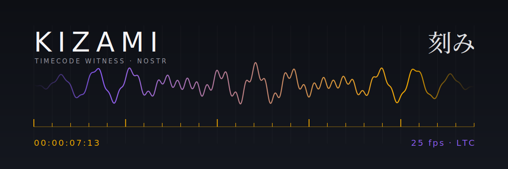

# Kizami 刻み

A Rust audio recorder that stamps recordings with SMPTE timecode and publishes
proof of *when* they happened as Nostr events.

刻み means "a notch, a tick, to engrave" — every frame of audio gets its notch in time,
and that notch gets written somewhere nobody can quietly edit.

## How it works

```
Tentacle Sync (BLE / LTC) ──► shokushu ──► Kizami ──► Nostr event ──► wss://hasky.chat
                                            │
                                            └── audio recording, timecode-stamped
```

- Timecode comes from a [Tentacle Sync](https://tentaclesync.com) over BLE, read via
  jb55's [shokushu](https://github.com/jb55/shokushu) crate.
- Kizami records audio, tags it with the running timecode, and publishes a signed
  note describing the recording to a Nostr relay.
- Anyone can later verify the note's signature and timestamp against the audio.

The hardware side — a cycle-exact timecode core on an open FPGA — lives in
[kizami-core](https://github.com/hasky00/kizami-core).

## Status

Early. Working today:

- [x] BLE scanning for Tentacle Sync devices
- [x] Publishing a Kizami note to `wss://hasky.chat`
- [ ] Audio recording wired to timecode
- [ ] Hash of the audio inside the note
- [ ] kizami-core over UART as a timecode source

## Build

```bash
git clone git@github.com:hasky00/kizami.git
cd kizami
cargo build --release
```

Set a permanent identity for the notes (otherwise a throwaway key is used):

```bash
export KIZAMI_NSEC=nsec1...
cargo run
```

Requires Rust stable and Bluetooth on the host (tested on macOS).

## Stack

Rust · [shokushu](https://github.com/jb55/shokushu) · [nostr-sdk](https://github.com/rust-nostr/nostr) · tokio

## License

MIT
